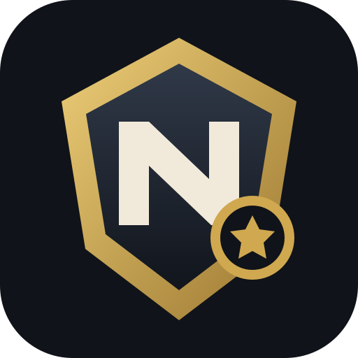

# NWN2 Workshop Manager

A Linux desktop app for safely managing **Neverwinter Nights 2: Enhanced Edition** Steam Workshop mods. It was designed around Bazzite and custom Steam libraries, but also supports standard native-Steam and Flatpak-Steam paths.



## What it does

- Finds NWN2 EE's Workshop content and Proton Documents folder automatically.
- Copies enabled Workshop mods into `Documents/Neverwinter Nights 2`.
- Normalizes `UI` to `ui` and loose `dialog.TLK` variants to `dialog.tlk`.
- Records which mod owns every installed file.
- Removes files after you unsubscribe or disable a mod.
- Restores the original NWN2 file when the final mod replacing it is removed.
- Handles overlapping files using a visible, adjustable priority order.
- Shows a complete change preview before synchronization.
- Imports the earlier `~/.local/share/nwn2-workshop-sync` script state when present.
- Preserves the existing manually modded folder during the recommended first-run setup.

## Install and run

1. Download `NWN2-Workshop-Manager-x86_64.AppImage` from the latest GitHub release.
2. Make it executable:

   ```bash
   chmod +x NWN2-Workshop-Manager-x86_64.AppImage
   ```

3. Open it. In **Settings**, you can also choose **Add to Applications** to create a normal desktop-menu shortcut.

If AppImages are not configured for direct launching on your system, this also works:

```bash
./NWN2-Workshop-Manager-x86_64.AppImage --appimage-extract-and-run
```

## First launch for the existing manual setup

The manager checks for the clean backup made during the original workaround:

```text
…/Documents/Neverwinter Nights 2.backup
```

Choose **Use Clean Backup** while NWN2 and Steam are closed. The app will:

1. Move the current manually modded folder to `Neverwinter Nights 2.manual-modded-backup`.
2. Copy the clean backup into place as the working folder.
3. Leave both safety copies intact.
4. Let the first Sync establish reliable ownership for every Workshop file.

Nothing is blindly deleted during this initialization.

## Everyday workflow

### Faster scans and manager updates (v0.2.0)

The first scan builds a mod file-list cache. Later scans reuse entries whose Steam
Workshop item metadata has not changed. Added/removed items are detected on Refresh
or launch. If Steam's manifest is unavailable, the app falls back to scanning.
Use **Full Verify** after manually adding files inside Workshop item folders.
Ordinary previews use saved size and timestamps to avoid reading unchanged file contents.

The manager checks GitHub for stable releases on launch (disable in Settings).
**Check for Updates** also checks manually. Downloads require confirmation and a
matching SHA-256 checksum; restart is optional. Updates live in the manager's
data folder and the old AppImage remains intact. Existing Applications-menu
shortcuts are redirected to the new version; opening the old downloaded file
still runs the old version. Version 0.1.0 needs one manual upgrade to gain this feature.

### One-click conflict tools

In **File Conflicts**, select a file and click **Choose Winner** (or double-click).
Click **Use [mod]** for that file, or **Prefer for all its conflicts** to choose that
mod for every overlapping file it supplies. **Auto-resolve by priority** clears
custom winners. **Apply / Sync** previews and confirms the actual file changes.
Disabled or removed winners fall back to enabled providers. These tools select
whole-file winners; they do not merge incompatible mod content. Overlapping files
remain listed even after a winner is chosen, so you can revisit the choice.

### Add a mod

Subscribe in Steam, wait for the download to finish, open the manager, then select **Preview** or **Sync Now**.

### Remove a mod

Unsubscribe in Steam, wait for Steam to remove its Workshop directory, then select **Sync Now**. The app removes that mod's files, restores a lower-priority enabled mod when one also supplies the file, or restores the original baseline.

### Temporarily disable a mod

Select it in **Workshop Mods**, choose **Enable / Disable**, preview the result, then sync. The Steam subscription remains untouched.

### Resolve a conflict

The **File Conflicts** page shows every shared destination path and its current winner. On **Workshop Mods**, select a mod and use **Raise** or **Lower**. Higher priority wins.

## Safety model

Manager data is stored in:

```text
~/.local/share/nwn2-workshop-manager/
```

Configuration is stored in:

```text
~/.config/nwn2-workshop-manager/config.json
```

The manager creates an original baseline before the first overwrite, writes replacement files atomically, tracks state in an atomic manifest, ignores Workshop symlinks, rejects path traversal, and refuses a restoration cleanup if an expected original backup is missing.

The app only manages files supplied by enabled Workshop item directories. It does not subscribe or unsubscribe on your behalf.

## Development

Python 3.10+ with Tk is required. No third-party runtime package is used by the app.

```bash
python3 -m venv .venv
.venv/bin/pip install -e . pyinstaller
PYTHONPATH=src .venv/bin/python -m unittest discover -s tests -v
PYTHONPATH=src .venv/bin/python -m nwn2_workshop_manager
```

Build the AppImage:

```bash
./scripts/build_appimage.sh
```

The GitHub Actions workflow tests every push and pull request, publishes the AppImage as a workflow artifact, and creates a release automatically when the version number is new. It also supports explicit `v*` tag builds.

## License

MIT
